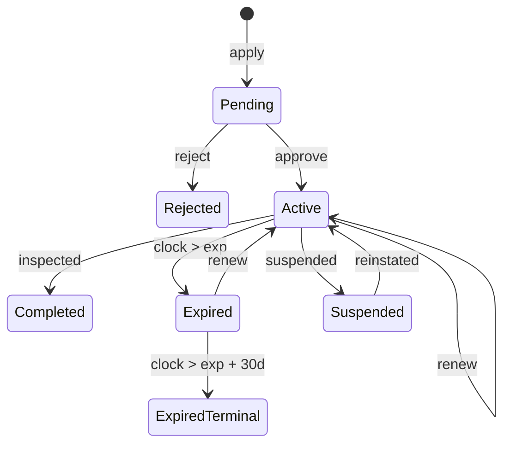

# Overview

The following simplified set of states and transitions are assumed to exist 
in a hypothetical permitting system - ostensibly used to track building type 
permits which are valid for a period of time and require an inspection to 
bring to a completed state. From an initial state a permit becomes Pending after an 
apply event occurs. From Pending a permit can become either Active (approved) or
Rejected (with a reject event). From Active, three possible states are possible:
Completed, Suspended and Expired.


Completed represents a terminal state following an "inspected" event. For 
simplicity, expiration is modelled as two states: Expired and ExpiredTerminal, 
where Expired is a non-terminal state (can be renewed) while ExpiredTerminal 
represents a situation where a grace period has elapsed.

Naturally, in a real system, more states would be possible but this 
generally represents a sufficiently rich set for analysis of the system.

For a given set of state transitions for a given permit_id, the state of all 
tables in the OLTP system will have exactly one form. The overall database 
state is a function of all state transitions for all permits over time. This 
approach makes it possible to simulate the system such that states of 
both the OLTP and OLAP databases can be robustly verified.

# Required analytics

## Permits states and transitions

All permit related analytics make use of state transitions over a given time or 
otherwise counting states. For instance, number of permits issued by type and 
month count Pending -> Active transitions. Similarly, activity trends 
(approvals, renewals, suspensions) also count transitions 
(Pending -> Active, Active -> Active, Active -> Suspended) which can be 
sourced from the PERMIT_ACTIVITY table. Active vs Expired permits count states 
within a given time bucket and grouping.

For this reason, there are two primary fact tables for permits: one that captures 
states and one that captures state transitions.

### fact_permit_transition
The primary grain of this fact table is one row per transition. We track the state 
that the permit transitioned to, its previous state as well as associated times. 
Furthermore, it uses permit_activity_id as the primary key as this may 
be useful for drilling down but also provides a natural high water mark for 
importing new data.

This structure is convenient for analytics as it is possible to answer general 
trends as well as KPI information which seems like it might be relevant here ( 
average time to transition from one state to another for instance).

```sql
CREATE TABLE fact_permit_transition (
    permit_activity_id INT PRIMARY KEY,
    permit_id INT NOT NULL,
    permit_type_key INT NOT NULL
        CONSTRAINT fk_fact_transition_type REFERENCES dim_permit_type (permit_type_key),
    from_state_key INT NOT NULL
        CONSTRAINT fk_fact_transition_from REFERENCES dim_permit_state (state_key),
    to_state_key INT NOT NULL
        CONSTRAINT fk_fact_transition_to REFERENCES dim_permit_state (state_key),
    date_key INT NOT NULL
        CONSTRAINT fk_fact_transition_date REFERENCES dim_date (date_key),
    transition_time DATETIME2 NOT NULL,
    from_state_entered_time DATETIME2 NULL  -- NULL on the apply row
);
```

### fact_permit_state
Although the state can be recovered from the transition table the query is 
relatively complex. It is expected that a simple state snapshot (by month) 
would be desirable for analytics and is therefore included in the ETL process. 
The grain of this fact table is one permit row per month.

```sql
CREATE TABLE fact_permit_state (
    month_key INT NOT NULL,
    permit_id INT NOT NULL,
    permit_type_key INT NOT NULL
        CONSTRAINT fk_fact_state_type REFERENCES dim_permit_type (permit_type_key),
    state_key INT NOT NULL
        CONSTRAINT fk_fact_state_state REFERENCES dim_permit_state (state_key),
    CONSTRAINT pk_fact_permit_state PRIMARY KEY (month_key, permit_id)
);
```

### Dimension tables
Standard dimension tables for date (as is customary in analytics), permit state 
and type are expected. 

```sql
CREATE TABLE dim_date (
    date_key INT PRIMARY KEY,       
    [date] DATE NOT NULL UNIQUE,
    month_key INT NOT NULL
);

CREATE TABLE dim_permit_state (
    state_key INT IDENTITY(1,1) PRIMARY KEY,
    name NVARCHAR(20) NOT NULL UNIQUE
);

CREATE TABLE dim_permit_type (
    permit_type_key INT IDENTITY(1,1) PRIMARY KEY,
    name NVARCHAR(100) NOT NULL UNIQUE
);
```

## Payments

A very important comment in the PERMIT_PAYMENT table description is the fact 
that "records may be updated after initial creation". It would be important 
to understand the nature of the mutations. For instance is only the payment 
status being changed or can amounts / other fields change. If the table is 
arbitrarily mutable it would be necessary to use WAL log / change data 
capture approaches. For simplicity however, a basic fact table structure 
is used with one row per PERMIT_PAYMENT row.

```sql
CREATE TABLE fact_payment (
    payment_id INT PRIMARY KEY,
    permit_id INT NOT NULL,
    permit_type_key INT NOT NULL
        CONSTRAINT fk_fact_payment_type REFERENCES dim_permit_type (permit_type_key),
    date_key INT NOT NULL
        CONSTRAINT fk_fact_payment_date REFERENCES dim_date (date_key),
    status NVARCHAR(20) NOT NULL,
    amount DECIMAL(19, 4) NOT NULL
);
```

# ETL
This solution primarily leverages the PERMIT_ACTIVITY and PAYMENT primary 
key fields, making the assumption that these are SERIAL / auto incrementing 
numbers. These keys are used in the fact tables which avoids the need to 
track additional state / high water marks for transferring the data from the 
OLTP to OLAP systems. It also helps in error situations, as long as a given 
id is processed transactionally the process can be restarted at any time. As 
configured the etl loading process is idempotent and can be run at any time.

# Building and running

```bash
# Setup environment / SQL server
export MSSQL_SA_PASSWORD="{pick a password for the instance}"
docker compose -f ./infra/docker-compose.yml up -d

# Download packages / build
dotnet restore ./src
dotnet publish ./src -c Release  -o ./ \
  -p:PublishSingleFile=true      \
  -p:SelfContained=true

# Create databases
./permits oltp init # Create the OLTP database
./permits olap init # Create the OLAP database
# Simulate events / database state
./permits oltp sim init --epoch 2025-01-01 --seed 42 --event-count 5000
./permits olap etl run # Idempotent - run any time
./permits oltp sim --event-count 1000
./permits olap etl run
./permits olap report ls # See all available reports
# Outputs all reports in CSV format for the time range
./permits olap report --name permits-issued-report --from 2025-01 --to 2025-12
./permits olap report --name active-vs-expired --from 2025-01 --to 2025-12
./permits olap report --name approvals-renewals-suspensions --from 2025-01 --to 2025-12

# Cleanup
docker compose -f ./infra/docker-compose.yml down
```

# Appendix A - Schema extension
For analytics use cases, immutable append-only / log-like records are best. 
A useful change to the payments table would be to make it completely immutable 
so that the current state of payments of permit payments can reliably be known.

# Appendix B - SQL Analysis

```sql
SELECT * 
FROM PERMIT p 
LEFT JOIN PERMIT_PAYMENT pp ON p.permit_id = pp.permit_id
```

For the query provided, the grain of the query result is one row per permit / 
payment pair (or just the permit if no payment exists). The data generally 
would not be incorrect but will have a lot of redudant information. While it is 
possible to count permits using this approach it would be necessary to first 
get a distinct set of permit_ids. For permit level reporting, it would be best 
to roll up the payments for a given permit. For payment level reporting, it 
would be more efficient to use a standard join but generally better to use 
the fact table approach designed in this solution. 
